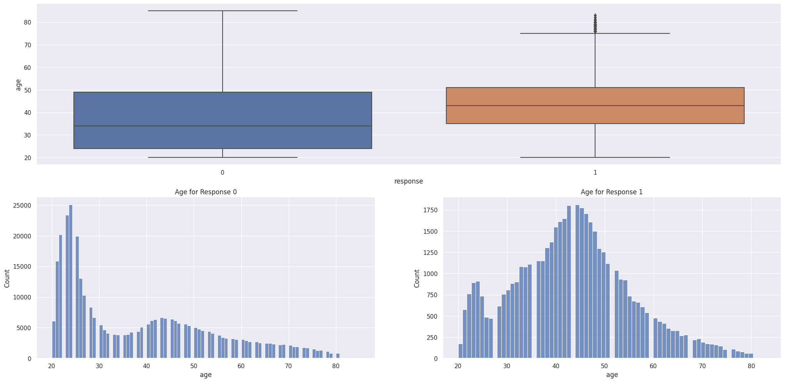
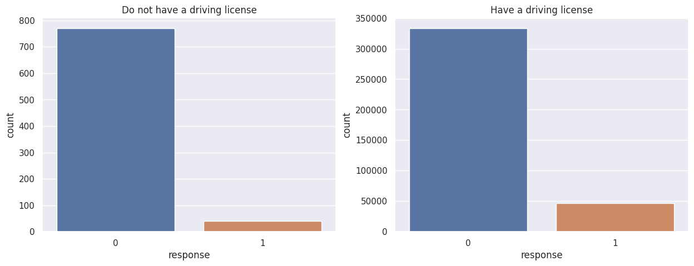
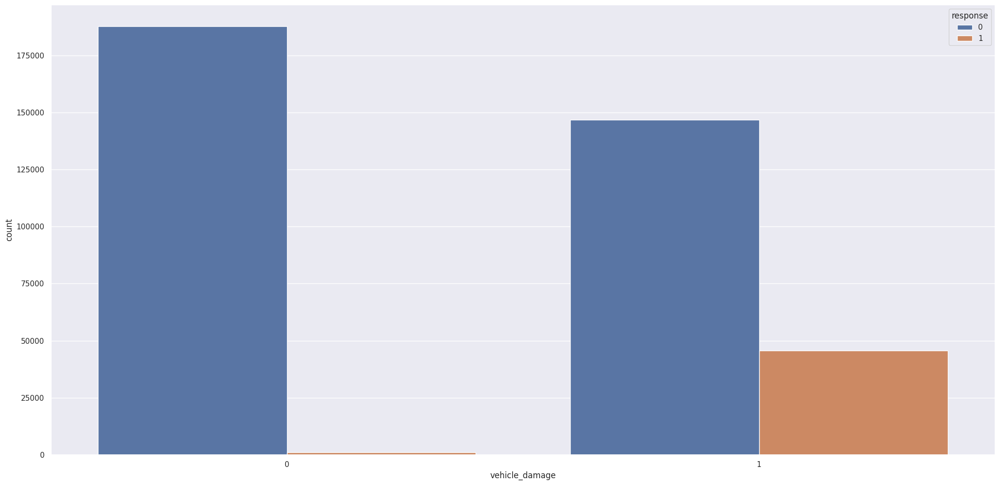
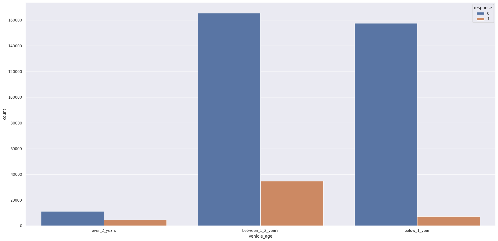
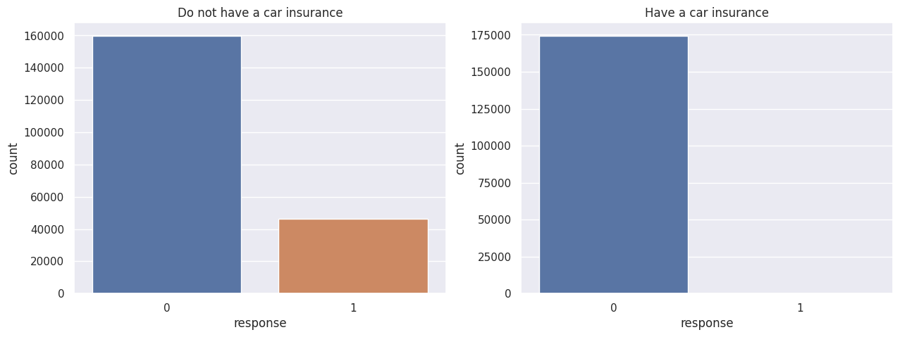
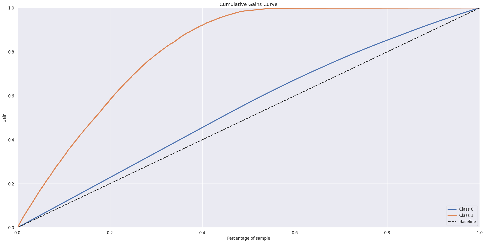
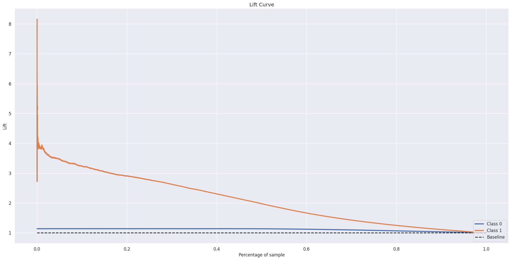
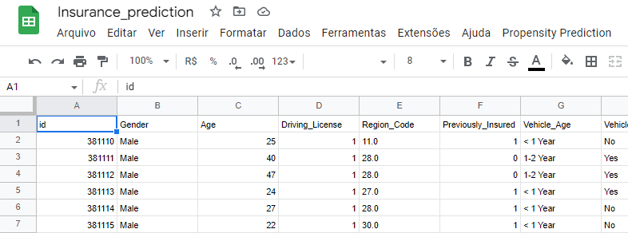

# Insurance Cross Sell Prediciton

Photo by [Vlad Deep](https://unsplash.com/@vladdeep?utm_source=unsplash&utm_medium=referral&utm_content=creditCopyText) on [Unsplash](https://unsplash.com/s/photos/car-insurance?utm_source=unsplash&utm_medium=referral&utm_content=creditCopyText).
  
# Conhecendo o negócio
 A Soter Insurance, é uma seguradora indiana fictícia, empresa que atua no mercado financeiro com foco na emição de apólices de seguros de saúde. Uma apólice de seguro é um acordo pelo qual uma empresa se compromete a fornecer uma garantia de compensação por perda, dano, doença ou morte especificados em troca do pagamento de um prêmio especificado. Um prêmio é uma quantia em dinheiro que o cliente precisa pagar regularmente a uma companhia de seguros por essa garantia.
 
O time de produtos está analisando a possibilidade de oferecer aos assegurados um novo produto: seguro de automóveis. Assim foi realizada uma pesquisa sobre o interesse em aderir ao novo produto. Os dados dos clientes e suas respostas foram salvos em um baco de dados.

Cerca de 100 mil clientes que não responderam a pesquisa foram selecionados para participar de uma campanha, na qual receberão a oferta do novo produto de seguro de veículos feita pelo time de vendas. No entanto, o time de vendas tem capacidade de realizar apenas 20 mil ligações dentro do período de campanha.

# 1. Questão de negócio
Considerando o limite de ligações possíveis e com o intuito de priorizar os interessados e maximizar os lucros é necessário prever se os clientes que contrataram um seguro de saúde do último ano também estão interessados em seguros de automóveis fornecidos pela empresa. 

## 1.1. Entendendo os dados
Para realizar a predição estão disponíveis dados demográficos, dos veículos e apólices de clientes com suas repostas de interesse ao novo produto de seguro.
|Atributo|Definição|
|--------|---------|
|id| ID único para cada cliente|
|Gender|Gênero do cliente|
|Age| Idade do cliente|
|Driving_License|0: Clinte não tem Carteira de Habilitação, 1: Cliente já tem Carteira de Habilitação|
|Region_Code|Código único para a região do cliente|
|Previously_Insured|0: Cliente não tem seguro de veículo, 1: Cliente já tem um seguro de veículo|
|Vehicle_Age| Idade do veículo|
|Annual_Premium| O valor do prêmio que o cliente pagará no ano|
|Policy_Sales_Channel|Código anonimizado do canal de divulgação ao cliente, ex: diferentes representantes, pelo correio, pelo telefone, em pessoa, etc.|
|Vintage|Número de dias que o cliente é associado à empresa|
|Response|0: Cliente não está interessado, 1: Cliente está interessado

# 2. Premissas de negócio
* O objetivo é elencar os clientes com maior propensão de contratar o seguro.
* Serão realizados 20 mil contatos com os clientes para oferta do seguro.

# 3. Planejamento da solução
O planejamento foi dividido em três etapas:

## 3.1. Produto Final
O resultado entregue será uma planilha no Google Sheets que apresenta a propensão de cada cliente de interesse no seguro de automóveis, ranqueando-os em relação a propensão.

## 3.2. Processo
### _Entendendo o problema de negócio_
Entender a motivação para a previsão e assim planejar a solução mais efetiva.

### _Coleta de dados_
Coleta dos dados dos clientes e respostas na plataforma [Kaggle](https://www.kaggle.com/datasets/anmolkumar/health-insurance-cross-sell-prediction).

### _Limpeza dos dados_
Colunas renomeadas.

### _Análise Exploratória de Dados (EDA)_
Exploração dos dados para entendimento de negócio e descoberta de insights para auxílio na determinação de features no treinamento do modelo de machine learning.

### _Feature Enginnering_
Transformação de features para facilitar a análise e preparação para os modelos de machine learning.

### _Preparação dos dados_
Aplicação de técnicas de normalização, rescaling e encoding dos dados.

### _Feature Selection_
Seleção das features relevantes que serão utilizadas para treinamento do modelo através dos algoritmos Boruta e ExtraTree.

### _Machine Learning Modeling_
Treinamento de algoritmos de Classificação com Cross-Validation estratificada. O modelo selecionado foi aperfeiçoado com Hyperparameter finetuning.

### _Avaliação do Modelo_
Avaliação do modelo treinado utilizando das seguintes técnicas: _Precision at k_ e _Recall at k_.

### _Resultados Financeiros_
Tradução do resultado para valores de negócio.

### _Deploy do Modelo (Google Sheets)_
Implementação da API para previsão da propensão de cada cliente em planilha online do Google Sheets.

## 3.3. Ferramentas

* Python 3.8.12
* Pandas, Seaborn, Matplotlib e Sklearn
* Flask e Python API's
* Git e Render
* Boruta
* Algoritmos de Classificação (k-Nearest Neighbors, Regressão Logística, Random Forest, ExtraTree, XGBoost, LightGBM e CatBoost)
* Cross-Validation, Hyperparameter Optimization
* Métricas de Performance (Precision at k, Recall at k)

# 4. Destaque dos Insights de negócio
Na exploração de dados, foram levantadas diferentes hipóteses para melhor entendimento do comportamento de cada atributo. Dentre as hipóteses, os seguintes insights foram destacados.

* **Clientes entre 40 e 50 anos são mais propensos a contratarem o seguro.**

* **Clientes que possuem habilitação tem maior interesse no seguro.**

* **Clientes com veículos que sofreram algum dano são mais propensos a contratarem o seguro.**

* **Clientes com veículos com idade entre 1 e 2 anos tem maior interesse no seguro.**

* **Clientes que já possuem seguro de automóvel não apresentam interesse.**

# 5. Modelos de Machine Learning
Foram treinados 6 modelos de machine learning para previsão das vendas, com cross-validation:
* Modelo Aleatório (Baseline para análise de performance)
* KNN (k nearest neighbors)
* Regressão Logística
* Random Forest Classifier
* XGBoost Classifier
* LightGBM Classifier
* CatBoost Classifier

Abaixo estão as performances de cada modelo em ordem crescente:

|Modelo|Precision at k|Recall at k|
|------|--------------|-----------|
|LightGBM Classifier|0,3026 +/ -0,0021|0,863 +/- 0,0059|
|CatBoost Classifier|0,3014 +/- 0,0022|0,8605 +/- 0,0063|
|XGBoost Classifier	|0,3012 +/- 0,0022|0,8597 +/- 0,0064|
|Random Forest Classifier|0,286 9+/- 0,0026|0,8189 +/- 0,0074|
|KNeighbors Classifier|0,2794 +/- 0,0019|0,7975 +/- 0,0056|
|LogisticRegression|0.275 +/- 0,002|0,785 +/- 0,0057|

O modelo escolhido foi LightGBM, que além de apresentar os melhores valores para as métricas analisadas, também tem alta velocidade de treinamento, facilitando o estudo dos hiperparâmetros para otimização.

Após otimização pelo método de Random Search, o modelo foi treinado com os novos valores de hiperparâmetros e os seguintes resultados foram obtidos na previsão de propensão nos dados de teste.

|Modelo|Precision at k|Recall at k|
|------|--------------|-----------|
|LightGBM Classifier|0,3536|0,6056|

## Entendendo as métricas
* Precision at k: dentre _k_ classificações de classe Positivo que o modelo fez, quantas estão corretas, ou seja, quantas realmente eram positivas.
* Recall at k: porcentagem de classificações de classe Positivo em _k_ previsões que o modelo fez, em relação ao total de classificações positivas.

Como restrição de negócio, k é igual a 20.000. A primeira vista, o valor de _Precision at k_ aparenta ser baixo, pois do total de predições feitas apenas _35,36%_ realmente são positivas. Porém o objetivo é elencar os clientes com maior propensão, que pode ser melhor analisado pela _Recall at k_, que aponta que com 20 mil contatos realizados, _60,56%_ de todos os clientes com resposta positivas foram alcançados.

## Gráficos
### Cumulative Gain Curve

Curva que indica a porcentagem da classe positiva em relação a porcentagem dos dados, com base na propensão prevista. Como pode ser visto, com 20% dos clientes contatados o retorno positivo é de proximadamente 60%, já com 40% dos clientes ranqueados, cerca de 90% dos interessados já são alcançados.

### Curva Lift

Indica quantas vezes o modelo de machine learning treinado é melhor do que o modelo aleatório. Com 20% dos clientes contatados, o modelo treinado é cerca de _3 vezes_ mais eficiente comparado com modelo aleatório.

# 6. Resultado de negócio
Para determinar os resultados financeiros, as seguintes premissas foram definidas:
* O número de clientes na base de dados será 95.278, onde 11678 clientes estão interessados no seguro.
* Com base nos dados de treino, é esperado que 12,26% dos clientes estejam interessados (Modelo Aleatório).
* O valor do prêmio anual é de ₹31.669 (rúpias indianas), mediana dos valores na base de dados.

|Modelo|Clientes interessados alcançados|Receita Anual|
|------|--------------------------------|-------------|
|LightBGM|7.071|₹223,932,417.40|
|Modelo Aleatório|2.451|₹77,627,439.16|
|Diferença|4.620|₹146.304.978,24|

Assim, o resultado financeiro esperado com o modelo de Machine Learning é **288%** maior do que o que seria alcançado com o modelo aleatório, como visto na Curva Lift.

# 7. Deploy do modelo
Para facilitar o acesso a lista ranqueada e agilizar o trabalho do time de vendas no contato com os clientes, foi desenvolvida uma [planilha no Google Sheets](https://docs.google.com/spreadsheets/d/1MCm4aB3zc9yzG3OtKKB5A29hwMd4M7UTEKaedmRkHBw/edit?usp=sharing). Com os dados de cada cliente inseridos, a predição de propensão pode ser determinada pelo botão "Propensity Prediction" na barra de menu, e em seguida clicando em "Get Prediction". Os clientes serão automaticamente ranqueados pelo seu score.

_O modelo que realiza as predições foi hospedado na Cloud Render._

# 8. Conclusão
O objetivo de priorizar os clientes com maior propensão que devem ser contatados, foi alcançado. Permitindo maior retorno de clientes interessados assim como otimizando o trabalho do time de vendas.
Além disso, foram gerados X Insights interessantes que podem ser utilizados pelo time de negócio.

# 9. Próximos passos
* Análisar a possibilidade de criação de features para melhorar o modelo.
* Aplicar outros modelos de classificação que possam capturar melhor o fenômeno.
* Aplicar a calibração do Modelo de Classificação para aumentar sua confiabilidade.
* Otimizar o modelo utilizando o framework [Optuna](https://optuna.org/).
